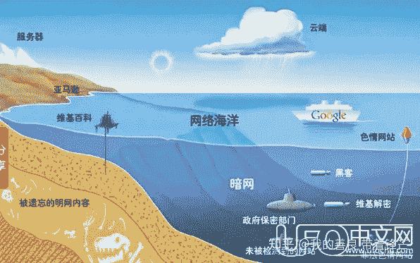

<!--yml
category: 暗网
date: 2022-11-04 11:39:12
-->

# 暗网，深网这也许是你们最不该进去的地方 - 知乎

> 来源：[https://zhuanlan.zhihu.com/p/267316235?ivk_sa=1024320u](https://zhuanlan.zhihu.com/p/267316235?ivk_sa=1024320u)

本文于2016-7-29 15:18发布于中文网| 发布者: 姓名未知

<figure data-size="normal">

<noscript></noscript>

</figure>

暗网是什么？你去过深网吗？“96%的互联网数据无法通过标准搜索引擎访问，虽然其中的大部分属于无用信息，但那上面有一切东西，儿童贩卖、比特币洗钱、致幻剂、大麻、赏金黑客……”

这段话出自美剧《纸牌屋》，在这部充斥着黑幕、丑闻、性与暴力的权力剧中，网络扮演着一个重要角色，女记者被杀，其男友就是通过暗网找到政府不为人知的秘密，最终将嫌疑人锁定为美国副总统。

这个剧情听起来很夸张，但是现实中确实有这样的网络存在，在这里，法律失去效力，违法物品明码标价，它甚至发展出了售前售后评价体系，可谓是“暗黑淘宝系列”，它就是暗网。

明网与暗网的较量

像所有的技术都会有善恶两面一样，网络在发挥共享信息造福人类的作用时，也出现了类似社会上黑白两道的结构分层，诞生了叫做明网、深网、暗网的三兄弟。

明网，也被称作是表层网络，这些是我们日常生活中会接触到的网络，通过谷歌、百度能搜索到的信息基本属于明网范围。

那些常规的搜索引擎没法搜到的网络，就是深网。比起明网，深网的最大特点就是，不是所有人都能进入，由于特殊的口令保护，有些网站不会被网络里的爬虫和蜘蛛搜到。比如美国税务局的一些网站，涉及到保密性，大众的普通搜索引擎是无法进入的。

但在深网里，还有一个更黑暗的分支，那就是暗网。暗网里的一切都是隐形的，网站隐形，用户身份隐形，IP地址隐形，上网者真正可以来无影去无踪。

在没有法律和舆论的监视下，暗网成了最血腥和暴力的地方，各种违法活动在线交易，包括售卖非法药物、儿童色情、盗用信用卡号码、伪造护照、贩卖人口和武器，走私珍禽异兽等，任何你可以想象到的犯罪形式，都可以在这里找到。你甚至可以雇一个杀手杀死一个你不喜欢的人。例如Contract Killer，就是一个专业的杀手门户，只要目标在 16 岁以上，无论身处何地，都可以成为暗杀对象。

暗网的由来

那么，这些网站是什么时候开始发展的呢？讽刺的是，与大多数技术的来源套路一样，这里就不得不提到始作俑者——美国军方。

1996年，美国海军研究试验所的科学家们提交了一篇论文，题目是《隐藏路径信息》，提出打造一个隐秘系统的构想，这个系统会让任何使用者在连接互联网时都会实时处于匿名状态，而不会向服务器泄露身份。这个系统建设十分有必要，一来可以保护各个国家的政见异己者，逃脱各个国家的专制压迫，普及美国人眼中的普世民主；二来能够为美国的情报人员提供信息交流的安全之所。

2003年10月，这一想法开始正式实施，为使用者提供免费的匿名网上场所。由于保护数据的密码就像洋葱一样层层包裹，这个系统最终被称为Tor（The Onion Router）。直到2011年，其60%资金仍来自美国政府。刚开始，它也的确为持不同政见者提供了庇护，但让美国政府尴尬的是，这个系统很快就开始堕落，成为了犯罪分子的天堂。2006年初，一个名叫“农贸市场”的网站开始出售大麻和克他命；臭名昭著的“丝绸之路”网站也是于2011年发源于Tor，用户可以在这里购买毒品、枪支和各种其他非法物品，最终由美国FBI亲自出面，花了一年多时间才剿灭。

然而，并不是所有的暗网都能被轻松解决掉。由于设计之初，就已经以不让任何软件检测到浏览痕迹和IP地址为目的，这个由美国政府亲自养大的网站，甚至强大到连设计者都无法销毁。2012年，“棱镜”项目揭秘者斯诺登除了揭露美国中情局监听全球的计划外，还泄露了一份美国国土安全部对于Tor的无奈，题目是《Tor糟透了》。文件讲述了国土安全部在摧毁Tor过程中遭遇的种种困难，并很悲观地表示：“我们将永远无法破解所有Tor用户的真实身份。”

数十年间，越来越多的暗网涌现出来，专家估计，暗网规模比我们的明网大400-500倍，储存着互联网90%以上的信息。今天的网络有5500多万注册域名，每个域名会有成百上千个子页面，但只有0.03%的网页是大众可以访问的，许多官方没有注册备案、普通人无从访问的，就是暗网的一部分。

暗网的流通货币**——**比特币

暗网能够爆发式增长，源于火爆的日常交易。5900美金可以获得包括美国护照、身份证、驾照等全套的证件；伪造的英国护照价值2000英镑；一把沙漠之鹰手枪1450欧元，当然，你可能还需要花45欧元买50发子弹。一份研究显示，2014年6大暗网市场稳定的日交易水平大体是在30-50万美元。

那么，当买家和卖家无法识别对方时，与金钱有关的交易又是如何发生的呢？这时候，比特币有了用武之地。

比特币是一种加密了的数字货币，不是国家机构发行，而是依据特定算法，通过网络节点的计算生成，并使用密码学的设计来确保货币流通各个环节安全性。而与其他虚拟货币不同的是，该货币数量十分有限，具有极强的稀缺性，比特币曾在4年内生成不超过1050万个，之后的总数量将被永久限制在2100万个，所以引起了投资者的疯狂追逐。

就像普通的现金在现实生活中的作用一样，比特币在互联网上可以用于任何交易，而且可以全世界流通和提现，一些网站甚至能接受比特币兑换美元、欧元等服务。更重要的是，它允许匿名，没有人能追查使用者在购买非法物品时的交易记录，所以比特币的发明使得暗网如虎添翼。

也有好的一面

如今，暗网已经成为极端恐怖组织募集资金、招聘人员的老巢，更和人口失踪、毒品泛滥、儿童色情等犯罪活动脱不了干系，各国政府都对它咬牙切齿，却又无可奈何。

但暗网的一切并非都是臭名昭著。在这个时代里，各个国家情报局对人民的监视无所不在，个人隐私似乎已经是很遥远的事情。但暗网的出现，为身份匿名提供了可能，暗网搜索引擎虽然无法提供高度个性化的搜索结果，但他们并不会跟踪你的网上行为，提供一系列针对性的广告。比特币可能不稳定，但它也能提供信用卡公司不能保证的隐私，这种不依靠政府发行的货币，甚至被当做是未来货币的可能形式。

不同于Facebook、Twitter、微信、微博这些能够被政府追踪和监管的网站，暗网还能提供更深层次的掩护，对于生活在暴力和压迫下的国家的公民，暗网提供与志同道合的人交流更安全的方式。卢森堡大学的研究人员在调查暗网上最常访问的材料后，他们发现，除了类似成人网站交易的非法活动之外，那些关注人权和信息自由的活动十分热门。

亦正亦邪，此时的暗网看上去更像一个打打杀杀的江湖世界，有黑道也有白道。捍卫隐私权，还是纵容犯罪？这是一场永无休止的博弈。