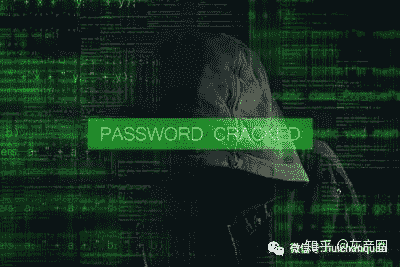
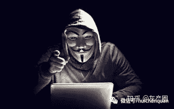
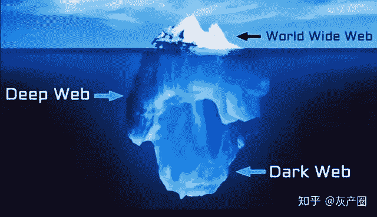
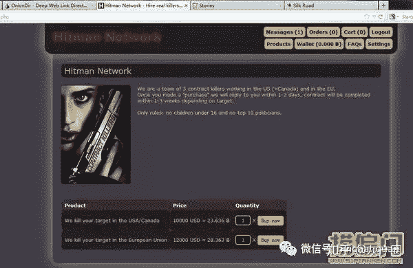
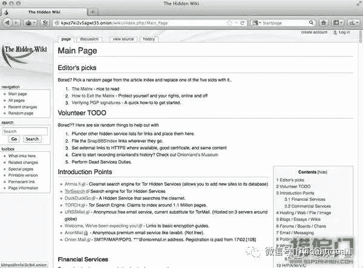
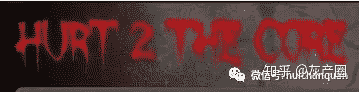
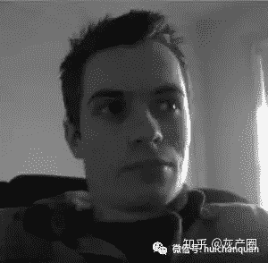

<!--yml
category: 暗网
date: 2022-11-04 11:39:57
-->

# 暗网|深网(Deep Web)才是真正网络偏门从业者的聚集地-偏门网 - 知乎

> 来源：[https://zhuanlan.zhihu.com/p/268316325](https://zhuanlan.zhihu.com/p/268316325)

今天在网络上见识到了深网，一位有多年深网浏览经验的程序员给我们做了个demo(让我感叹美国大学的开(hun) 放(luan)性(xing)，这按说不是非法的东西么。。。)

深网传输的数据是层层解密的，类似于一层层的剥洋葱。发送者发送的数据包是复杂的多层结构，传输经过的每一个节点只有一把密钥，只能打开数据包中的一小部分。这些节点一般都是由信奉信息自由的志愿者的电脑组成，因为只掌握一小部分数据包，他们本人是不可能了解全部信息的。只有传输到信息接收者前的最后一个节点能够掌握全部信息(这个节点上的隐私性如何保证尚不清楚)。他展示了其中一个毒品交易网站，和淘宝、亚马逊好像啊!还有买家评价呢。。给好评哦亲~据说美国邮政局傻乎乎的充当着此类非法交易的中坚力量。

深网还可以跟踪比特币的交易，当然所有交易都是匿名的，只能看见付款方和收款方的可公开代码。但是理论上来说，如果某一笔比特币最初是通过与现实货币交易得来的，那么一直追溯到最初时间点上，还是有可能破获使用者身份的。

<figure data-size="normal">

<noscript></noscript>

</figure>

首先，深网不那么血腥暗黑，但是各种乱七八糟的东西是很多的，比如各种drugs、各种porns、洗钱、各种犯罪等等，你在大脑里幻想过的乱七八糟的事情总会有人有钱实现的就是。由于用深网的人并不多，所以暗网本身的发展并没有一般的互联网那么完善和齐全，停留在一个比较粗糙的阶段。界面也粗糙，信息堆在一起也比较混乱。人们只是为了实现简单的功能而使用着。

由于深网本身进行的许多事情都是需要匿名的，所以深网的使用者一般会注册一整套完整的与外界网络不同的用户信息，包括在深网里提供服务的邮箱，各种账户，等等。

至于什么暗网占90%之类的言论，简单点说，绝对不可能。

至于我还看到网上有一点说可怕不可怕的问题，这看你见过多少可怕的东西了，像我这种人看到什么只要不要当场飙血基本都不会觉得可怕的，人世间阴暗的东西多了去了。

网上流传的那什么恐怖经历啊，纯粹是夸张了扯扯淡吓唬吓唬新网民，不说它的出处就是在一个灵异论坛上，我想就在你所生活的城市里，或者是这个国家里，估计也在发生着。

<figure data-size="normal">

<noscript></noscript>

</figure>

请看正文：

96%的互联网数据无法通过标准搜索引擎访问，其中的大部分属于无用信息，但那上面有一切东西，儿童贩卖、比特币洗钱、致幻剂、赏金黑客……这段对话出自美剧《纸牌屋》。但无法被谷歌等搜索引擎所找到的“地下世界”却在真实世界里存在，“深网”(Deep Web)无法被搜索引擎找到，而“深网”中所蕴藏的“暗网”(Dark Web)即使你知道网站地址，普通的浏览器也无法浏览。

“深网”技术构建最初源于美国军事机构，1996年美国海军研究试验所的科学家提出一个构想，在某个系统中，任何使用者在连接互联网时都会实时处于匿名状态，而不会向服务器泄露身份。在这个系统构想中，保护数据的密码像洋葱一样层层叠叠，于是他们将之称为“洋葱网络”(Tor, The Onion Router)。如今，“深网”早已不仅限于美国军方使用。有专家分析，与现在能够搜索到的表层网络(表网)相比，深网的信息量要庞大得多。

<figure data-size="normal">

<noscript></noscript>

</figure>

深网：宛若隐藏在深处的冰山

在深网，你会发现“打碎三观”的大量令人震惊的内容：盗版、黑客、毒品、军火、血腥、暴力、色情、阴谋论、职业打手，甚至是恐怖分子。有人说“深网”是网络世界的罪恶天堂，也有人说，“深网”是人性最深处的黑暗。

澳大利亚记者Eileen Ormsby从数年前就开始关注并追踪报道暗网毒品交易网站“丝绸之路”——“丝绸之路”藏身于洋葱路由(The Onion Router)，只接受虚拟货币比特币，以此规避银行和政府的监管。“暗黑系淘宝”激发了Eileen Ormsby对“暗网”世界的兴趣，从2012年起，她便在个人网站All Things Vice和主流媒体上发表对暗网世界的观察。今天我们来听她聊聊暗网。

暗黑系淘宝

我们都知道，你可以在暗网上买卖毒品，但“丝绸之路”绝不是深网里唯一的电商平台。下面是一些你可能从来没有想过的商品：

家里需要重新装修?花上1500美刀，你可以给自己买一个缩小的人类头颅。正品保障，全球包邮，保证低价。卖家称自己是“艺术家”，制作缩小版人头是他的创作激情。

另外一个卖家提供授精服务，只需要620美刀。

如果你需要额外的器官，这里是报价。一个心脏6.5万美刀，一个肺3万美刀，一个肾2万美刀。

需要赏金猎人?“暗网”供应充足，平均价格在2万美刀，不过如果你的目标是妇孺，价格就得升到3万美刀了。不过你预算实在有限的话，也可以花个6美刀，买个含有HIV病毒的针筒，自己动手。

如果你的目标罪不至死，倒不如找“特种部队”吓唬他一下，5美刀，特种部队会安排几个警察温柔地教训他一下，20美刀，特种部队就会亲自出马。

<figure data-size="normal">

<noscript></noscript>

</figure>

赏金猎人联盟网站截屏

如果你有需要的商品，但不喜欢“品牌直营”，那么，Buttery Bootlegging可以为你专门下“盗窃单”。 如果你自己就是绿林好手，那么花上270美刀，就可以有人帮你把失窃车辆改头换面，这是你去欧洲运送或买卖毒品的最好配置，当然坑蒙拐骗偷盗抢夺也都适用。

25美刀/页，枪手帮你写大学论文，10页以上的长篇论文可以议价;几美刀可以买到主流色情网站会员账号;8美刀可以雇个法国“好心人”帮你祈祷。

最后不得不提，特价33万美刀，就可以买一张应对世界末日的“伊甸园”计划的入场券，这笔钱还包括了你地堡的建造费用，位置位于西伯利亚阿尔泰-金山，地堡带游泳池、健身房、家庭影院和家庭农场，你可以自由种植蔬菜、鱼类或者大麻。

免责声明：我毫不怀疑里面这些东西是骗局，如果你执意要购买，钱财两空了别怨我。

当你通过浏览看到了一些内容，基本上都不属“暗网”

关于“暗网”的传言层出不穷，有时候我忍不住想提醒大家，“暗网”更确切的技术名字叫“隐藏的服务器”，我想这个名字已经很清楚说明了“暗网”的特征吧。

暗黑系淘宝也许让你觉得好玩，但你不能忽略一个事实：“暗网”有多“暗”，我在为新文章收集素材时也不时会被所发现的内容而感到震惊。

网上有很多问答帖子，“暗网上有什么?”，“浏览暗网是什么体验?”很多人会分享一些他们登录了Tor之后浏览到的一些站点内容，往往这些站点都收录在The Hidden Wiki这个暗网维基网站上。

<figure data-size="normal">

<noscript></noscript>

</figure>

The Hidden Wiki 主页

暗网远早于“丝绸之路”就已存在，但“丝绸之路”让“暗网”得到大众的关注。“丝绸之路”是第一个获得商业成功且不想躲藏在暗处的“暗网”网站。原因很简单，黑市需要客人。他们把自己的网站域名列在暗网维基和其他Tor的网站名录上，他们并不意图隐藏，他们只想隐藏网站的服务器和所有人信息。

但是还是要提醒各位，Tor“隐藏服务器”的初心便是让所有不知道这些服务的人完全找不到它们。这些服务是绝对不会在Reddit、营销邮件、论坛或者社交媒体上留下域名地址或者其他信息。如果你恰好遇上了一个真正的“暗网”，你绝对不会发现花哨的图片(Tor的浏览速度有多慢了，上了的人就知道)，不会有注册链接，不会有问答。

有些人告诉我，通过暗网维基等网站入口找到了一些论坛，但需要邀请码或者推荐人信息才能进入。不过他们发现这些网站的准入的门槛并不高。但是我想说的是，它们并不真实，它们只是一些分散在各处吸引记者、好奇八卦者和执法机关的幌子，真正的网站谁也不知道到底在哪里。充其量，这些网站是一个试验场，可以供他们挑选出有价值的“贡献者”，邀请其去真正的网站。

因为我专注写暗网的文章，所以在Reddit或是Twitter上，常有人私信我，问我是否可以“带他们”去某些站点。我总是回答，“不行”。我对研究这些暗网网站没有任何兴趣，下面是原因：

1、首先，我们开动脑子来想一想，为什么这些网站要藏在暗处?除了不泄露个人隐私外，让我们的想象力稍微疯狂一点，是不是也有下面这些可能：

a.儿童色情及虐待色情 。我没有任何的欲望去登录浏览任何这方面的网站，我一点点好奇心也没有，并不是因为浏览下载传播这些素材在许多国家都是绝对非法的行为，和法律没有关系，我只想说，看了之后洗眼睛也没有用了，我不想自己噩梦连连。

b.黑客计划。我是电脑技术白痴，所以让我去“调查”这些内容基本就是白费劲。

c. 恐怖袭击计划。我相信，现实世界里，恐怖分子应该是用电话交流的，但是即便他们真的用“暗网”，应该也不是英语，可惜我只会英语所以也看不懂。而且他们在暗网里，我可是在明处，我都是用真名发表文章的，我可不想招惹这些人。

2、其次，既然“暗网”的目的就是不被找到，那么知道这些暗网存在的人绝对不会告诉我。在整个洋葱网络里我大概是匿名度最低的一个人了，你觉得真的有人会跑过来对我说，“哈咯，我最近发现了一个吊炸天的暗网，对了，你不是记者吧?”

3\. 最后，如果人想真正的，真正地保守秘密，那么他们不仅仅会隐藏他们的服务器，隐藏他们的通信轨迹，我相信，他们也会将通信内容进行加密，这样，只有掌握解密方法的特定用户能读懂这些内容。所以即便是我真的“撞”进了这些[暗网]，我也只能看到随机字符串，却依然不得其门而入。

分享我与“暗网”最亲密的一次接触吧。有个自称“黑客”的人联系了我们，我们聊了会天后，他发给了我一个洋葱地址(暗网的网站域名大多为.onion)，我打开网址后看到一个纯白色的网页，上面只有两个输入框，用户名和密码。我根据“黑客”给我的信息依次做了输入，我进入了一个类似4Chan讨论区和IRC聊天室的页面。在我还没有反应过来，或者想起截屏的时候，我就被弹出到登录页面，而黑客给我的信息不再有效。

过了几个小时，我再次尝试打开洋葱地址，却只有“找不到网页”的错误提示，而自此黑客也不再和我联系了。

这可能是一个骗局，我之前也遇到了许多类似的遭遇;但也许这一次我偷看到了一个真正“隐藏”的“暗网”，但是和往常一样，我永远都不会知道答案。

最暗最暗的“暗网”有什么内容?

我曾经戏谑地报道过一度在“暗网”里流传的视频直播处死ISIS恐怖分子的恶作剧，但这一次我实在笑不出来。四名澳大利亚人已经因为在“暗网”中的一系列行径而遭到拘捕。这里是万丈深渊，藏污纳垢，有人性里最暗的部分。

今年9月，我旁听了Matthew David Graham的法庭审判，他面临13项指控，均和他化名Lux在“暗网”打造的儿童虐待网上帝国的行径有关——在这些网站，他提供恋童癖主题的信息百科、在线聊天、图片和视频服务。其中最著名的就是他运营的Hurt2theCore网站，如网站名字所显示的，这是以儿童虐待为主题的网站，孩子的伤痛和虐待并不是性接触的副产品，而是施虐者故意施加的，不仅如此，施虐者还对此进行记录和公开发布，来满足其他Hurtcore爱好者。

自澳大利亚政府启动针对清理“暗网”儿童虐待内容的主题行动以来，Matthew David Graham是第三个被捕的澳大利亚人。

<figure data-size="normal">

<noscript></noscript>

</figure>

Hurt2TheCore网站截屏

我在为撰写“丝绸之路”一书收集素材时发现了这一网站，一看到网站首页你就会立刻意识到遇到了什么，绝对不会有人会“无意”间注册了儿童虐待“暗网”。无论是配图还是网站注册声明里都明确地告诉你，你会看到什么内容。

H2TC只为用户提供聊天功能及视频和图片上传功能，网站不对用户提交的内容做任何审查或管理。网站有专门的板块让用户交流孤儿的“租赁”和“购买”信息。Lux在2013年曾公开宣称，H2TC每天新增326个注册用户，160多个新帖，每天视频下载量高达1.5万。

网站还为“原创作者”提供奖励，他们可以进入到该网站的一个特别的“房间”，专为制片人而设。其中最臭名昭著的一位“制片人”就是Daisy's Destruction系列视频的制作人Peter Scully，是的，很遗憾，他也是澳大利亚人。

关于Daisy's Destruction系列视频的流言、谣言早已尘嚣日上。虐待杀害一个婴儿的视频成为流行甚广的病毒视频这一可笑的事实尚不能让一些人感到满足，那些试图寻找到“暗网最黑暗真相”的人又继续传播一些虚妄夸张的故事。

虽然视频令人极度不安，但幸运的是，婴儿Daisy并没有遭杀害，现在已经得到看护和照顾。但“制片人”Peter Scully因谋杀儿童的指控而遭捕，在他的住所警方发现了一具儿童尸体。

Matthew David Graham(Lux)原定于在9月8日上午9:15通过视频会议的方式接受墨尔本地方法院的审判，但他担心拘留所的其他人会听到他讲话的内容，还是坚持自己出庭。直到当天下午4点他才出现法庭上，当时旁听的人几乎都已经离开，只剩下The Age报的一名记者、法官、警察、律师、Lux，还有我。

<figure data-size="normal">

<noscript></noscript>

</figure>

Matthew David Graham(Lux)

他只有22岁，但看上去更年轻，书呆子气，还没有到长痘痘的阶段。他环顾了下空荡荡的法庭，给所有在场的人一个明亮的笑容，似乎他想和在场的所有人交朋友。看到他本人给了我一种奇异的感受，他犯下了让经验最丰富的侦探都瞠目结舌，令人发指的罪行，难道不应该有一些怪诞变形的外观特征吗?

好吧，他看上去和“怪物”没有什么关系，他没有什么特别的地方，他走在我们当中，没有人会怀疑他。事实上，他似乎是那种会被人轻易遗忘的人。

被捕后，他试着说服警方，他建立Hurt2TheCore是为了引诱虐待儿童者入网。幸好，没有人买单。

我的想象力有限，无法想象还有什么比上述这些人所运行的网站更黑暗的暗网了。

但在网络上，“暗网”哪里有真正黑暗的东西?如果我深入去挖掘“暗网”资源，还会有什么是我可以发现的?类似这样的提问和讨论依然层出不绝。还有一些人为了追求更多点击，甚至在炮制更加邪恶和恐怖的视频作品。

只是就我而言，我希望我们已经看到了“暗网”的最黑暗的一面。

**最后，物以类聚，人以群分，接触更优秀的人也可以让你成为同样的人，欢迎关注官方公号：阿航课堂**

**阿航课堂:培养你的发散性思维 解密互联网骗局、实战揭秘互联网灰产案例、网赚偏门项目解析、分享网络营销引流方案。深挖内幕、曝光各类套路。**

<figure data-size="normal">

<noscript></noscript>

</figure>