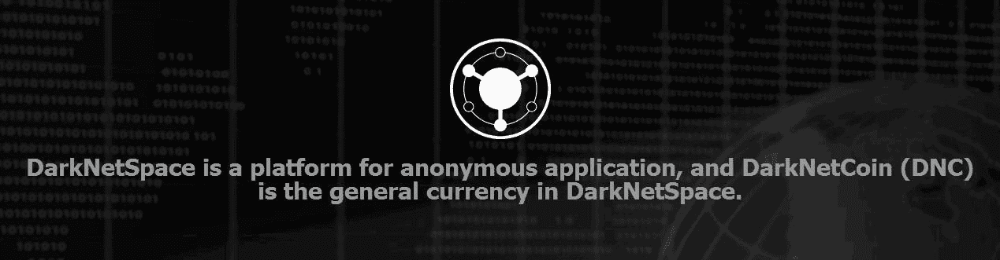
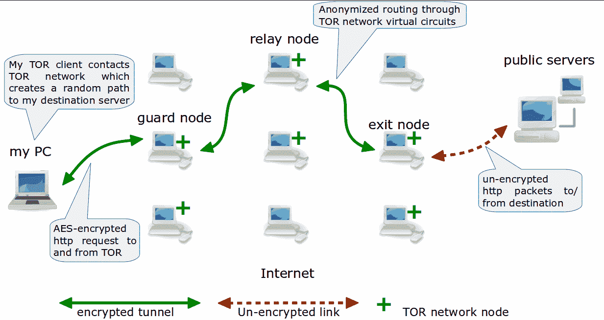
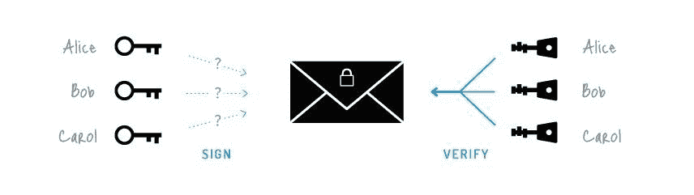

<!--yml
category: 暗网
date: 2022-11-04 11:42:11
-->

# 比特币与暗网空间 - 滚动 - 碳链价值

> 来源：[https://www.ccvalue.cn/article/10583.html](https://www.ccvalue.cn/article/10583.html)

比特币与暗网空间

比特币与暗网空间

比特币这个名字从2013年底的大涨大跌以来成为了国内新闻争相报道的头条，不论夹杂着好消息和坏消息，连大妈都在问隔壁电脑公司上班的邻居儿子哪里可以买到这个炒起来比股票黄金还刺激的东西。随着全球各个国家对比特币加强实名监管以及各项立法以后，比特币在全球经济中越来越受重视。现今比特币的新闻里面充斥着挖矿、期货、融资等围绕着比特币价值本身的话题，比特币本身则成为交易所中随波涨跌的虚拟黄金。

比特币有一定的匿名性，但是匿名性较弱，通过协议监听、兑换所实名、伪装节点等手段可以拿到IP地址或实名与比特币地址的对应关系，使得比特币网络的匿名性受到威胁。比特币不应该再发展匿名性，而是应该越来越公开和光明，主动接受各国政府的监管。如果现在还去强调和研发比特币的匿名性，只会让各国政府越来越敌视，被打压以至于转入地下，这是所有比特币从业者和爱好者所不愿意看到的。但是比特币诞生时所挥舞的去中心化和匿名大旗该由谁来继承？

在比特币建立起数字加密货币中的金本位后，竞争币和二代币争相出位，纷纷秀出自己的特色来对整个数字加密货币生态圈添砖加瓦。 二代币除了具有比特币本身的支付功能外，更多的是去中心化的扩展开发，将数字加密货币的应用方向引导向支付以外的范围。在二代币的应用环境中，几乎所有的应用功能都在本地的钱包里完成，下面是具体例子。

P2P交易所：比特币时代需要将各个币种预存到一个中心化交易所网站，根据交易行情涨跌来买入或卖出，最终还需要一个提现的操作。整个流程中各种货币都存放在交易所网站，于是用户对交易所的信任就变成对交易所管理层的道德拷问，很不乐观的是Mt.Gox事件为中心化交易所这个方式抹了大大的一笔黑。而二代币则可以在钱包里直接获得区块链上的行情数据，实时的进行本币种与其他币种的兑换，避免了中心化交易所的不安定因素。

块链商城：有别于ebay这样的中心化商城，用户可以在钱包里发布或搜索商品，和卖家讨价还价，最终达成交易，所有交易和商品数据都公开存在于区块链数据中，任何人都可以查询，这就可以证明买卖双方信誉度无法作伪，创造一个公平安全的交易环境。

智能合约：在分布式交易中，当用户购买了商品，并不需要直接将货币支付给商家，而是可以建立一个智能合约，让这个合约监控商家提供的物流数据直到商品寄到家里被签收后才释放货币给商家。智能合约还可以用于商务合同以及遗嘱、赌约等等，只要符合预设条件，合约就会准时并且公平的执行，完全避免了人为操作的失误和作弊。因为所有数据都存在于区块链中，智能合约还具有天然的抗灾害损毁功能，只要互联网和区块链上的部分节点存活就不会影响合约的执行与存在。

二代币的出现并不是要取代比特币，而是对虚拟货币经济圈的补充，打个比方，比特币是黄金，我们去超市买个日用品是没法揣个金元宝去买的，只能通过付钞票或者是刷卡，二代币就是将比特币这个黄金活用起来的方法与渠道。

新近发布的暗网空间(DarkNetSpace)就是二代币应用平台的其中一员，官网：http://darknetspace.org 。在初期公布的ROADMAP中除了上述基于区块链的应用外，特意将强匿名作为开发重点，将用户隐私保护放在第一位。暗网币(DarkNetCoin)则是暗网空间中流通的虚拟货币，暗网空间采用了多种新技术来提高匿名性，其中有：

Tor匿名网络: Tor是美国军方早期开发的军事级别的加密通讯网络，现在已转为民用技术。钱包接入Tor网络以后可以隐匿自己的真实IP，以防被恶意人群分析真实IP与钱包地址之间的关系。

环签名技术：通过随机选取公钥签名来防止签名被伪造，也无法追踪签名者的身份。暗网空间使用该技术隐藏了发送者，相当实现了混币。

隐身地址：与公开的地址不同，在每次交易的时候生成一次性地址，所以无法在公开的区块链浏览器中找到真实地址，从而使分析追踪交易链来追溯资金来龙去脉变成一件不可能的任务。

远程交易释放技术：这是暗网币独创的匿名技术，类似于TOR，但是进行协议内加密，把本地的新交易层层加密，每经过一个节点解密一层，传输到远程节点释放，每个节点只知道前后节点IP，不知道数据内容，让节点监听和多节点大数据分析无计可施。

通过以上四大匿名技术，暗网空间将成为有史以来“最”匿名、“最”隐私的应用平台。对于保护隐私的人们来说，这是继比特币之后的“最”好选择。目前已经上线币游网coingame.io，可以用暗网币玩21点、压大小、德州扑克之类游戏。