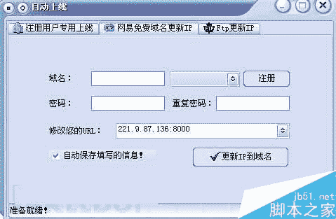

<!--yml
category: 病毒
date: 2022-11-04 11:48:39
-->

# 远程控制木马最初、后来和现在面临的问题_安全教程_网络安全_脚本之家

> 来源：[https://www.jb51.net/hack/496012.html](https://www.jb51.net/hack/496012.html)

远程控制木马的意思是远程桌面需要在路由器设置端口映射，才可以让自己的机器暴露给广域网，这样别人才能通过外网ip来连接操作需要接受协助的机器。

传统意义上的远程控制木马由于适用面不广,使用比较单一,只注重功能不注重一些安全上的问题,**出现过的事故就有:**

1.控制者被反查；

2.控制者机器被利用文件下载上传文件反控；

3.相关黑客被杀；

4.抓鸡黑客被网警追捕；

5.主要成员被国际通缉等。

**传统的远程控制木马**

**最初**

1\. 大多使用tcp协议作为其主要通信协议,没有采用对应的加密措施。

2\. 木马文件经过加壳或者没有加壳,可轻易被分析出特征码。

3\. 相关功能都被整合到了一起,免杀时间短。

4\. 不稳定性,遇到复杂的网络环境可能存在上线难的问题。

5\. 上线采用动态域名,经过不可靠第三方中转信息可被轻易拦截或者伪造。

6\. 大多采用注册表启动或者注册服务启动,少有修改文件方式。

7\. 存在可执行文件,dll,sys,启动方式大多采用独立启动,没有或者少有文件感染,进程注入。

8\. 种马感染方式单一,大多采用网络传输方式感染。

9\. 驻留方式单一,大多是驻留在系统。不存在反沙盒分析功能。

10\. 大多是c/s结构,即client/server。木马文件普遍较大。

**后来**

1\. 除了tcp木马之外出现了udp木马,但依然没有采取加密措施。

2\. 木马在原有加壳基础之上,开始出现了自写壳,反调试等反分析措施。

3\. 由原来的整合到一起开始出现了生成器/控制端的模式,免杀时间稍微变长。

4\. 上线开始出现了多种上线模式,出现了网站空间上线、FTP上线、数据库上线。

5\. 稳定性变强。出现了反弹上线木马。

6\. 开始出现修改系统文件,修改服务启动方式隐藏自身。

7\. 开始出现了迷你版本木马,出现了无进程,文件感染,进程注入技术应用。

8\. 出现了多种感染方式,木马本身在感染母体后出现了感染移动设备的情况。

9\. 开始出现了驻留bios,感染映像文件木马。依然不存在反沙盒分析能力。

10\. 出现了b/s,即浏览器/服务器模式交互通信木马。稳定性变强。文件比起上一代变小了一些。

**现在**

1\. 除了tcp,udp木马之外,开始出现了https,ssl木马,但本身还是会被抓到木马原型。

2\. 木马在原有加壳,自写壳,反调试基础之上,出现了shellcode木马,dll木马,纯进制文件靠其他文件加载木马。

3\. 由原来的生成器/控制端模式开始出现了模块化木马,抗分析,免杀能力变强。

4\. 上线由原来的单一上线模式出现了支持混合协议上线模式木马,一个服务器被封，可保持被控者依然不掉。

5\. 稳定性在原有基础之上变得更强,除了反弹上线之外,出现了依靠其他服务上线木马。

6\. 除了原来的修改、感染文件方式之外，出现了感染声卡，感染网卡方式。

7\. 除了无进程之外，出现了无文件，无端口端口木马技术应用。

8\. 除了感染移动设备外，出现了跨平台感染木马，内网感染木马，会感染比如智能交易终端之类的设备。

9\. 出现了反内存分析、文件定时自动变异木马，会给分析带来一定难度。

10.出现了混合控制方式木马，可以b/s也可以c/s。

11.由原来的从vc/delphi/vb之类的语言编写的远控木马开始出现了脚本编写的远控木马程序。体积更小，方式更加隐蔽。

**目前面临的问题。**

1\. 远控传输协议的问题,没有好的加密协议很容易出现通信被拦截/伪造问题,给自己带来危险。一些防火墙设备也可以轻易拦截通信。

2\. 远控的免杀问题,传统的木马很容易在取到特征后就被杀毒软件查杀,一直没有出现好的反杀毒软件思路。

3\. 启动加载方式问题,传统的比如注册表，文件，服务启动，很容易被比如(x60之类)软件拦截,许多杀软也比较看重注册表。

4\. 文件驻留问题,驻留在系统很容易被取到样本文件,也会导致木马本身生存周期变短。

5\. 文件操作问题，所有功能都集中在了一起，很容易被识别为木马文件。

**暂时性的解决措施：**

1\. 远控传输协议采用公钥方式加密,文件生成时可选择伪造某种可信软件报文方式。

2\. 在文件特征上,采用密钥方式分段加密,内存分段解密运行后删除上一次操作记录,静动交互+加密模式对抗特征捕获。

3\. 加载方式采用非注册表加载，注入硬件核心驱动文件加载。

4\. 系统只驻留主要支持文件，或者完全靠注入后文件操作。

5\. 功能文件采用插件方式,用完即删,即使被捕获也很难被分析认定为木马。

**未解决的问题:**

源头/ip地址很容易被侦查员捕获的问题,采用私有云,p2p方式待实践。

只有更新的木马/黑客技术才能促进整体的安全进步。

以上就是脚本之家小编为大家详细的介绍的关于远程控制木马的教程，需要的用户快来看看吧，想了解更多精彩教程请继续关注脚本之家网站！