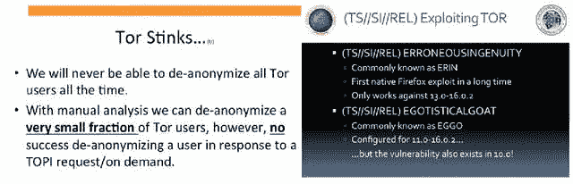
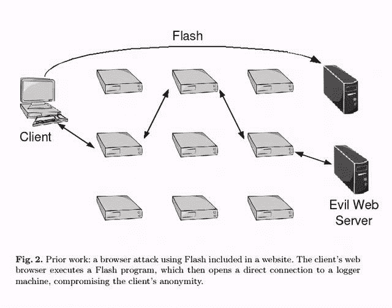
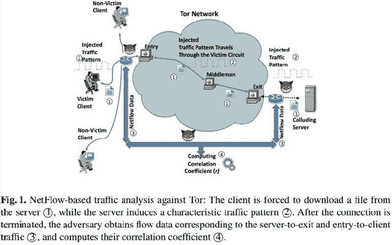
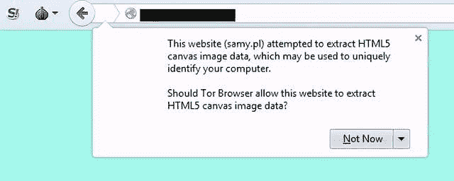
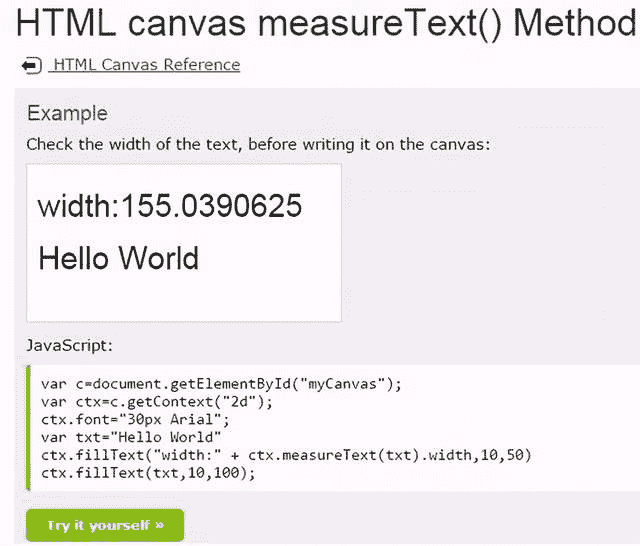
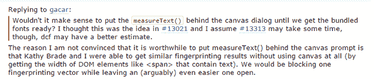
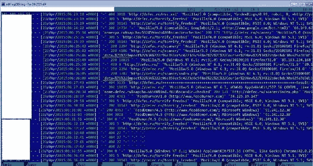
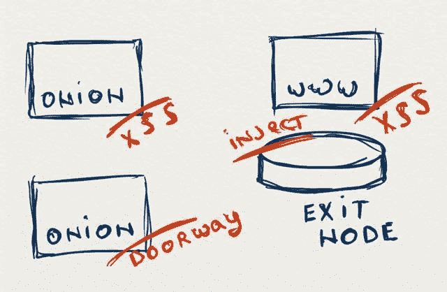
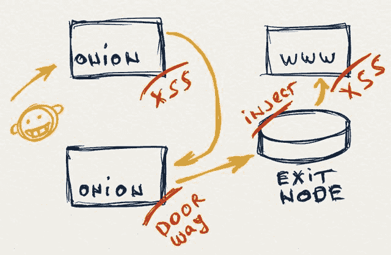
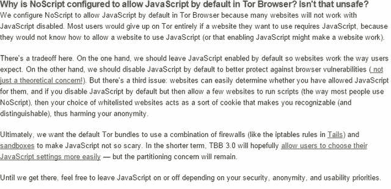

<!--yml
category: 暗网
date: 2022-11-04 11:40:46
-->

# 追踪那些隐藏在暗网深处的匿名者 - 哔哩哔哩

> 来源：[https://www.bilibili.com/read/cv9449231/](https://www.bilibili.com/read/cv9449231/)

<figure class="img-box" contenteditable="false"></figure>

**大家好！我是黑客Anony**

<figure contenteditable="false" class="img-box">

<figcaption class="caption" contenteditable=""></figcaption>

</figure>

**Tor用户是如何被确定身份的？**

纵观暗网的发展史，总有人尝试各种方法挖出匿名用户的真实身份。姑且可以把攻击手段分为两类:对客户端的攻击(浏览器)，和对网络流量的攻击。

**Web浏览器存在的隐患**

从泄露出来的NSA文档中可以看到，由于Tor浏览器是基于Firefox开发的，所以，情报机构可以利用Firefox中的漏洞进行攻击。然而，正如NSA报告中提到的那样，利用漏洞工具并不能长期的监控暗网居民。漏洞通常只有很短的生命周期，浏览器的版本也一直在升级，所以只有很小的一部分人在使用有漏洞的浏览器，这就导致相关部门只能监控小范围内的用户。

<figure contenteditable="false" class="img-box">

<figcaption class="caption" contenteditable=""></figcaption>

</figure>

被泄露的NSA文档，包括对Tor用户如何被曝光的介绍(来源：www.theguardian.com)

除了这些非官方发布的文档，Tor社区也发现了针对客户端的有趣的攻击。例如，来自MIT的研究人员已经发现了Flash会创建一条专用通道连到攻击者的专用服务器，这条通道包含了客户端的真实IP地址从而识别出受害者的身份。然而，Tor浏览器的开发人员通过在浏览器中禁用Flash传输通道，已经迅速解决了这个问题。

<figure contenteditable="false" class="img-box">

<figcaption class="caption" contenteditable=""></figcaption>

</figure>

通过Flash通道发现受害者的真实IP

另一个针对浏览器进行攻击的方法就是使用WebRTC DLL。和上面提到的Flash通道一样，这个动态链接库是用来支持HTML5中视频流量传输的，而且它也可以记录受害者的真实IP。WebRTC的请求，使用STUN协议，并用文本传输，因此可以绕过Tor网络，引发严重后果。但Tro浏览器开发人员通过默认禁用WebRTC功能，也已经迅速修复了这个小缺陷。

**对通信通道的攻击**

和浏览器攻击不同，针对Tor客户端和服务器之间的网络流量进行攻击看起来有些牵强。到目前为止，提出来的大多数理论也大都是在实验室环境中实现的。针对真实Tor网络通信的攻击还未有人发表相关的文章。

在这些理论研究中，达成的一个基本的共识就是使用NetFlow协议来分析网络流量。这篇文章的作者坚信，攻击者对直连的Tor节点或是在节点附近的路由器的网络流量进行分析，可以从网络流量中得到如下信息：

`网络协议号 记录编号 出入的网络接口 数据流的首尾的时间戳 数据流中的数据包大小和个数 源地址和目的地址 源端口和目的端口 IP协议号 服务类型值 TCP连接的标志位 源地址和目的地址的子网掩码`

<figure contenteditable="false" class="img-box">

<figcaption class="caption" contenteditable=""></figcaption>

</figure>

基于流量分析识别Tor客户端(来源:https://mice.cs.columbia.edu)

这种基于流量分析的方案，如果攻击者想要在任意时间段内识别Tor用户，那么他需要Tor网络中大量的数据采集点。正是由于没有充足的计算资源，独立的研究员很难将上述研究应用到实际环境中去。所以，我们应该换个思路，考虑一些更容易方法，去分析Tor用户的活动。

**被动监控系统**

任意的网络用户都可以共享计算机资源来建立一个节点服务器。节点服务器是Tor网络中对客户端数据进行转发的一个中间人的角色。由于退出节点需要对流量进行解密操作，所以它们很可能成为信息泄密的来源。

这就有可能让我们从解密的数据流量中收集相关的信息，例如，onion资源地址可以从HTTP头中提取。但由于HTTP数据包中可能包含一些关于不活跃的onion站点的干扰信息，所以可能会避开内部搜索引擎和站点分类。

然而，由于研究人员暂时只能分析在实验室中自己生成的网络流量，所以，被动监控还不能在实际的网络中识别出用户的真实身份。

**主动的监控系统**

为了找出更多的暗网居民，我们需要诱导他们，从而获取更多系统环境中的数据。也就是说，我们需要一个主动的数据获取系统。

一个来自Leviathan Security的专家发现大量的退出节点，并在真实的环境中部署了一个主动监控系统。这些节点和普通的退出节点不同，因为他们可以向二进制文件中注入恶意代码。当客户端采用Tor技术来隐藏自己，并从网上下载文件，这些恶意退出节点就会进行中间人攻击，将恶意代码插入正在下载的文件中。

上述事件是主动监控系统概念的一个很好的例证。然而，它也从另一方面证实了，退出节点上的任何行为，都会很快且很容易地被自动化工具识别，从而将这些节点快速地加到Tor社区的黑名单中。

**让我们从头开始**

HTML5不仅实现了WebRTC ，而且带来了有趣的”画布”标签，一个通过JavaScript脚本，创建位图的功能。这个标签有个特性就是可以用来渲染图片，而且根据不同的因素，每个浏览器渲染出来的图片也不同。其中的因素有：

`不同的显卡驱动和安装在客户端的硬件设备 操作系统中软件的不同设置和软件环境的不同配置`

这些渲染参数可以唯一地识别出浏览器和它的软硬件环境。基于这种特性，一个所谓的指纹就产生了。这并不是一个新的技术，它已经被在线的广告代理商用来追踪用户感兴趣的事物。然而，并不是所有的识别技术都可以在Tor浏览器中使用。举例来说，supercookies就不能在Tor浏览器中使用，Flash和Java是被默认禁用的,字体的使用也受到限制。其他的一些方法，也向用户发出警报。

因此，我们的初步尝试使用的，通过getImageData()函数提取图片数据的“画布指纹”，已经被Tor浏览器禁用了。

<figure contenteditable="false" class="img-box">

<figcaption class="caption" contenteditable=""></figcaption>

</figure>

然而，我们目前仍然可以找到其他漏洞，作为Tor中的指纹识别，并且不会向用户发出警报。

**通过字体，我们就可以认出他们**

Tor浏览器可以通过画布中测量被渲染文本宽度的measureTest()函数进行识别。

<figure contenteditable="false" class="img-box">

<figcaption class="caption" contenteditable=""></figcaption>

</figure>

用measureTest()获取对操作系统具有唯一性的字体大小属性

如果得到字体宽度具有唯一性(有时是浮点数)，那么我们就可以去识别不同的浏览器，当然也包括Tor浏览器。我们知道，在某些情况下，生成的字体宽度值对不同的用户可能相同。

我们应该意识到，获取唯一值并不是只有这一个函数。另一个类似的函数，getBoundingClientRect()也可以获取文本框的高度和宽度

当用户指纹问题被社区所知晓(也影响到了Tor浏览器用户)，一个合理的的安全需求就被提出来了。然而，Tor浏览器的开发人员并不急于在配置中修复这个问题，这也说明了，仅仅将这些函数放入黑名单是无效的。

<figure contenteditable="false" class="img-box">

<figcaption class="caption" contenteditable=""></figcaption>

</figure>

Tor开发者对字体渲染问题的官方回应

**实战演习**

这个方法是有一个叫做”KOLANICH”的研究人员提出的。利用measureTest()和getBoundingClientRect()这两个函数，他写了个脚本，用来测本地的不同浏览器，并获取唯一的标识。

用同样的方法，我们也布置了一个测试床，用来获取不同软硬件环境下的Tor浏览器的指纹信息。

为了达到目的，我们向用户访问的网页中，嵌入了包含measureText()和getBoundingClientRect()两个用来测量字体渲染函数的JavaScript脚本。这个脚本，会将获取的数据通过POST请求，发送给web服务器，服务器将该请求日志记录下来。

<figure contenteditable="false" class="img-box">

<figcaption class="caption" contenteditable=""></figcaption>

</figure>

记录Tor浏览器指纹的日志片段

此时，我们正在收集script获取到的数据。到目前为止，所有的返回值都是唯一的。在适当的时候，我们会将这个实验的结果公布于众。

**在实际环境中可能的部署方法**

上述的方法如何在现实的环境中识别Tor浏览器用户? 如上所述的JavaScript代码可以在暗网的不同环节进行部署：

`退出节点。可以采用中间人攻击，当暗网居民访问外部网络时，将JavaScript代码注入到被访问的网页中。 内部的onion资源和外部的网站由攻击者所控制。举个例子，攻击者为浏览信息的用户精心构造了一个插入JavaScript代码的网页或是网站导航，收集所有访问者的指纹信息。 内部和外部的网站一般都存在跨站脚本攻击(XSS)漏洞(最好是存储型XSS，但不是必须的)。`

<figure contenteditable="false" class="img-box">

<figcaption class="caption" contenteditable=""></figcaption>

</figure>

可以收集Tor用户指纹信息的目标

最后一项研究尤其有趣。我们已经搜索了大约100个具有web漏洞的onion资源并且排除了误报的情况。最后，我们发现被分析的暗网资源中大约有30%都具有跨站脚本攻击漏洞。

这就意味着，在退出节点进行攻击并不是攻击者识别一个用户的唯一手段。攻击者还可以通过有漏洞的网站插入JavaScript脚本，来收集唯一的指纹信息。

<figure contenteditable="false" class="img-box">

<figcaption class="caption" contenteditable=""></figcaption>

</figure>

识别一个Tor用户的流程

攻击者并不受限于将JavaScript脚本插入到合法的网站。由于可用来注入目标的数量在增加，包括那些暗网中的网站，所以JavaScript脚本的注入目标可以有更多的选择。

通过这个方法，攻击者可以在理论上发现例如指纹信息为‘c2c91d5b3c4fecd9109afe0e’的用户对网站的哪些主题感兴趣，并查看这个用户访问了哪些网站。所以，攻击者可以对用户对哪些网络资源感兴趣有个大概的了解，并且可以查看该用户的上网记录。

**不是总结的总结**

在Tor项目的官网上，开发人员对“为啥Tor浏览器支持JavaScript脚本”做了解答。

<figure contenteditable="false" class="img-box">

<figcaption class="caption" contenteditable=""></figcaption>

</figure>

Tor浏览器对JavaScript问题的官方解答

从这个答案的可以看出，我们并不指望开发人员在Tor浏览器中禁用JavaScript代码。

关于Tor退出结点研究，都是纯理论的，我们并没有在真实的服务器上做研究。而且，所有的测试都是在和Internet隔绝的虚拟的暗网中完成。

**译者的话**

如果能看到这里，先感谢大家支持。